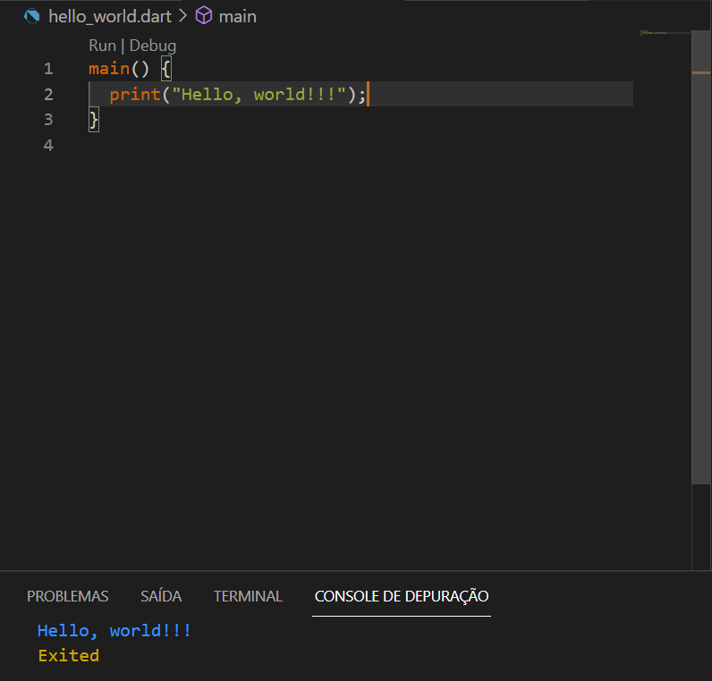
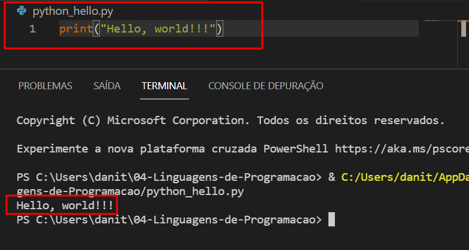
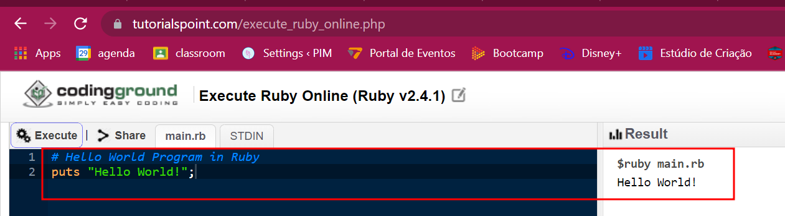
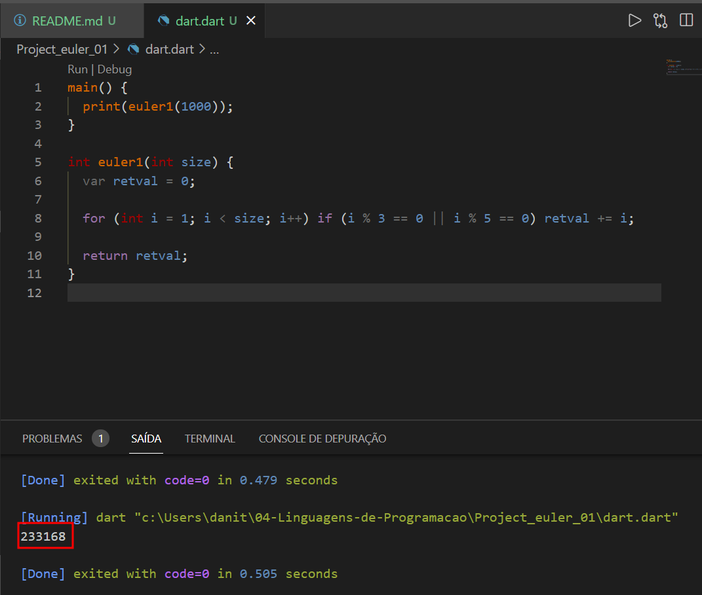
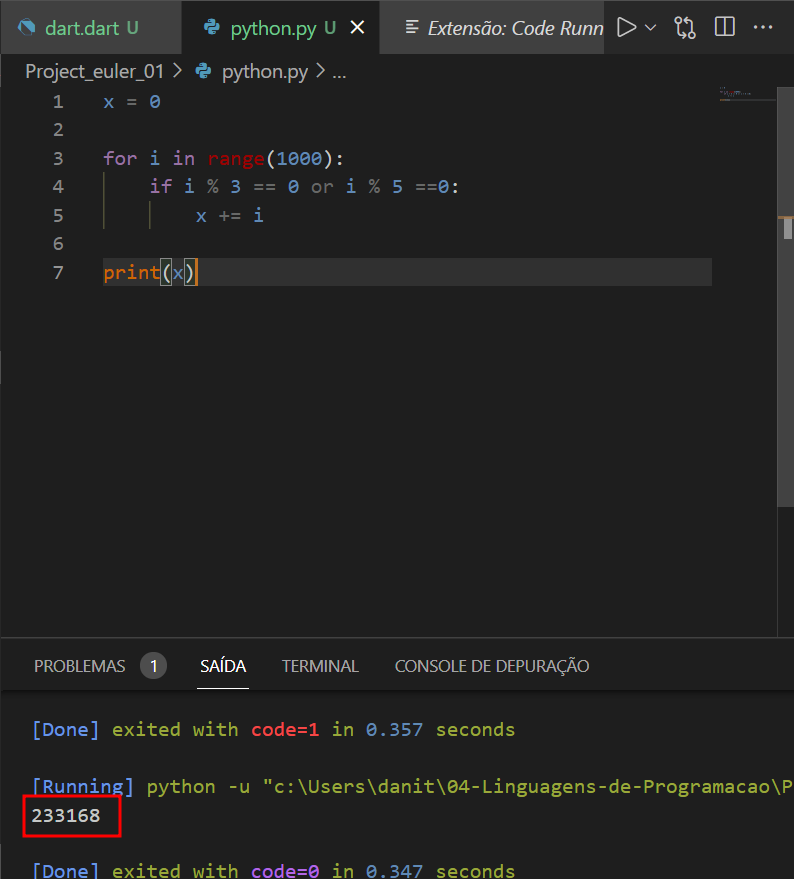
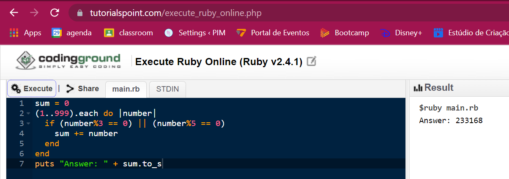
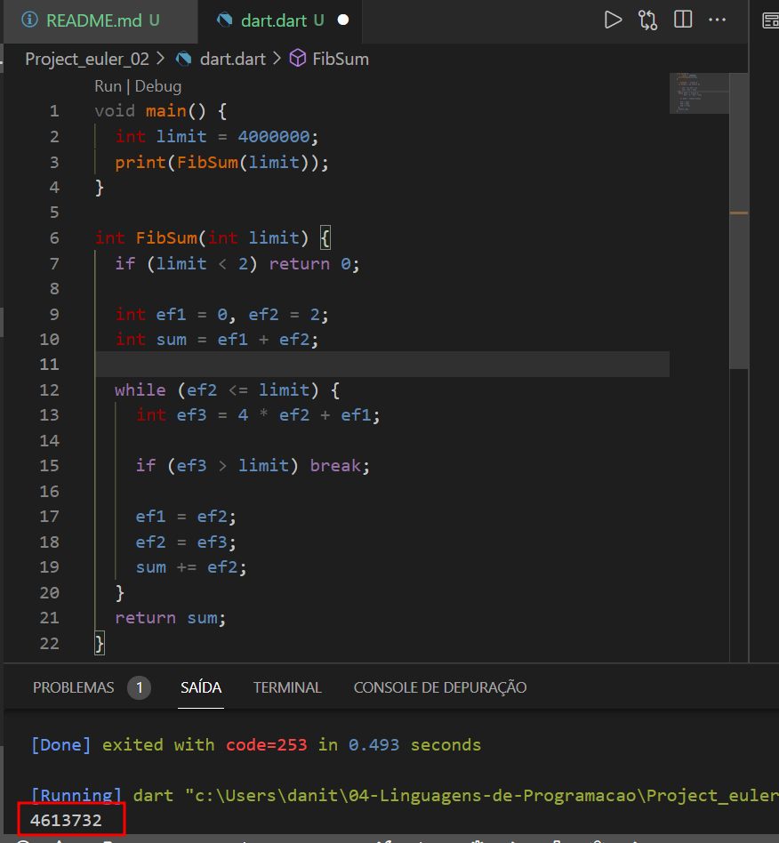
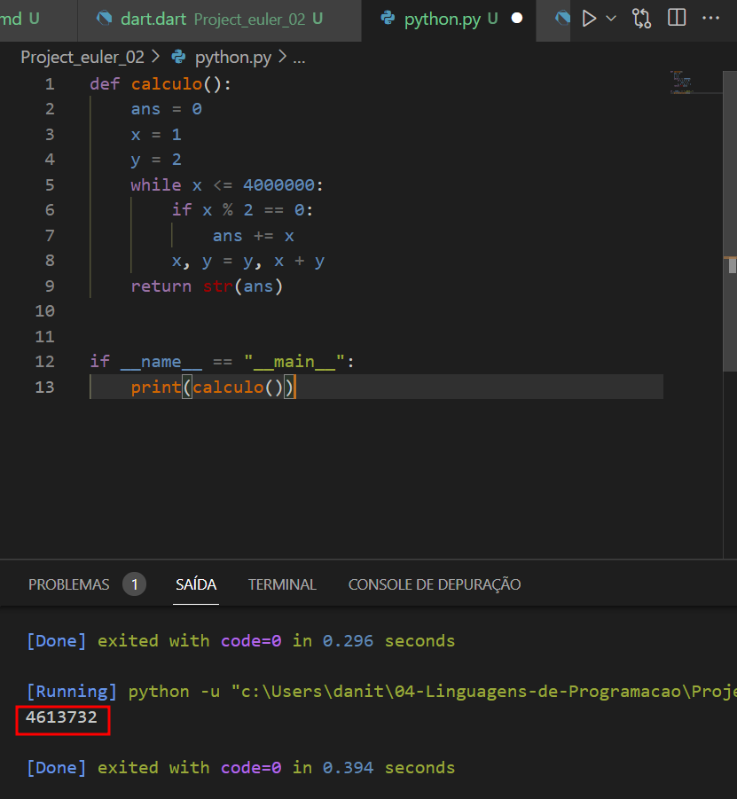
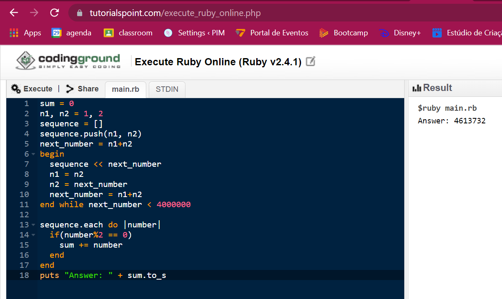

# Atividade 04: Exploração de linguagens

- Linguagem A: Dart
- Linguagem B: Python
- Linguagem C: Ruby

    > Professor, aqui na linguagem Ruby eu tentei de todas as maneira executar os comando mas não consegui. Não consegui fazer o compilador funcionar, então executei online e deixei os códigos aqui.

---

# **Escreva o famoso programa “Hello, world” e execute o programa na sua máquina.**

## Dart

[Link para o repositório](https://github.com/danitorelli/04-Linguagens-de-Programacao/blob/main/Hello_world/hello_world.dart)

    

## Python

[Link para o repositório](https://github.com/danitorelli/04-Linguagens-de-Programacao/blob/main/Hello_world/python_hello.py)

    

## Ruby

[Link para o repositório](https://github.com/danitorelli/04-Linguagens-de-Programacao/blob/main/Hello_world/hello_world.rb)

    

---

# Questão #1 do Project Euler.

## Dart

[Link para o repositório](https://github.com/danitorelli/04-Linguagens-de-Programacao/blob/main/Project_euler_01/dart.dart)

    

## Python

[Link para o repositório](https://github.com/danitorelli/04-Linguagens-de-Programacao/blob/main/Project_euler_01/python.py)

    

## Ruby

[Link para o repositório](https://github.com/danitorelli/04-Linguagens-de-Programacao/blob/main/Project_euler_01/ruby.rb)

    

---

# Questão #2 do Project Euler.

## Dart

[Link para o repositório](https://github.com/danitorelli/04-Linguagens-de-Programacao/blob/main/Project_euler_02/dart.dart)

    

## Python

[Link para o repositório](https://github.com/danitorelli/04-Linguagens-de-Programacao/blob/main/Project_euler_02/python.py)

    

## Ruby

[Link para o repositório](https://github.com/danitorelli/04-Linguagens-de-Programacao/blob/main/Project_euler_02/ruby.rb)

    

---

# Respondam as perguntas:

- **Como é o ambiente da linguagem?**

> Eu achei as duas linguagens (python e dart) parecidas no sentido de facilidade de aprender. Se comparado com Java, ambas são bem mais simples e sucintas, mais próximas da nossa linguagem falada, o que torna o aprendizado mais intuitivo. Gostei bastante. A linguagem Ruby foi beeem complicada, apanhei muito para conseguir fazer e entender (acho que tem coisas que eu ainda não entendi). Para um primeiro contado, amei python, dart foi legal e não gostei muito de ruby (mas ainda tenho que estudar mais e quem sabe mudarei de ideia).

- **Como foi a instalação do ambiente? (compilador, interpretador, site)**

> Para o Python e Dart foi super fácil, usei o chocolatey e com apenas um comando instalei as duas. Usei o VSCode para escrever os códigos, e quando fui executar pela primeira vez, ele mesmo sugeriu um interpretador e fiz a instalação. Para o Ruby fiquei mais de 1 hora tentando fazer o compilador funcionar e não obtive sucesso, então fui para um programa de execução online. [Link usado para executar Ruby online](https://www.tutorialspoint.com/execute_ruby_online.php)

- **Qual foi o seu sentimento em relação a linguagem para escrever o programa?**

> Para Python e Dart Foi paixão à primeira vista rsrs, inclusive já vi que em python eu consigo usar alguns frameworks como o selenium ou robobrowser para automatizar tarefas e já consegui automatizar minha primeira tarefa com o python enquanto eu estudava para essa atividade!!!! Já o Ruby, a princípio não gostei muito, achei um pouco complicado para entender e principalmente para executar.
